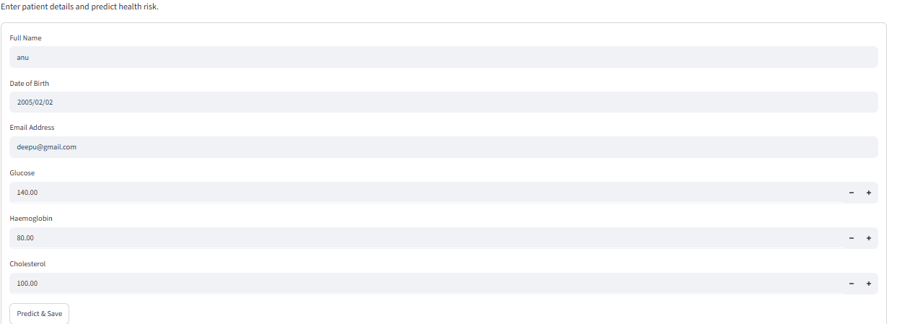
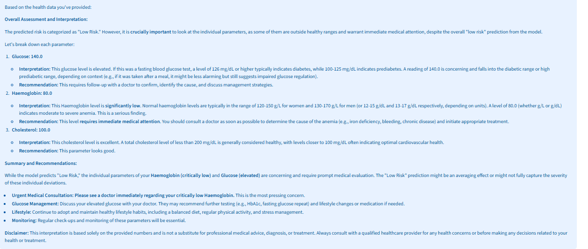
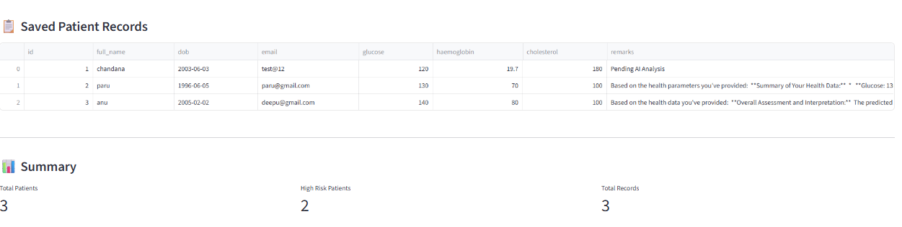

# 🏥 Health Prediction Application

## 📌 Project Overview

The Health Prediction Application is an AI-powered healthcare system developed using Python, Streamlit, SQLite, and Google Gemini AI.

This application allows users to enter patient health parameters, predict health risk levels, generate AI-powered health remarks, and store patient records in a database for future reference.

---

## 🚀 Features

### Patient Data Management

* Add patient records
* Store patient information in SQLite database
* View saved patient records

### Health Risk Prediction

* Analyze health parameters including:

  * Glucose
  * Haemoglobin
  * Cholesterol
* Predict risk levels:

  * Low Risk
  * Medium Risk
  * High Risk

### AI-Powered Health Recommendations

* Integrated with Google Gemini AI
* Generates personalized health remarks
* Provides health insights and recommendations

### Interactive Dashboard

* User-friendly Streamlit interface
* Real-time predictions
* Easy data entry and visualization

---

## 🛠️ Technologies Used

* Python 3.12
* Streamlit
* SQLite3
* Google Gemini AI
* Pandas
* Git & GitHub

---

## 📂 Project Structure

HealthPredictionApp/

├── app.py

├── database.py

├── gemini_helper.py

├── model.py

├── patients.db

├── requirements.txt

├── README.md

└── .gitignore

---

## ⚙️ Installation

### Clone Repository

```bash
git clone https://github.com/sripathichandana26-cpu/health-prediction-app.git
cd health-prediction-app
```

### Create Virtual Environment

```bash
python -m venv venv
```

### Activate Virtual Environment

Windows:

```bash
venv\Scripts\activate
```

### Install Dependencies

```bash
pip install -r requirements.txt
```

### Run Application

```bash
streamlit run app.py
```

---

## 📊 Sample Health Parameters

| Parameter   | Example Value |
| ----------- | ------------- |
| Glucose     | 130           |
| Haemoglobin | 13.5          |
| Cholesterol | 180           |

---

## 🤖 AI Integration

The application uses Google Gemini AI to:

* Analyze patient health data
* Generate health recommendations
* Provide personalized medical insights
* Support healthcare decision-making

---

## 🧪 Testing

Successfully tested with multiple patient records and verified:

✅ Patient Data Entry

✅ SQLite Database Storage

✅ Health Risk Prediction

✅ Gemini AI Recommendations

✅ Streamlit User Interface

---

## 📸 Application Screenshots

Add screenshots of:

1. Patient Registration Form

2. Risk Prediction Result

3. Patient Records Dashboard


---
## 👩‍💻 Developer

Chandana Sripathi

GitHub:
https://github.com/sripathichandana26-cpu

---

## 📄 License

This project is developed for educational and portfolio purposes.
